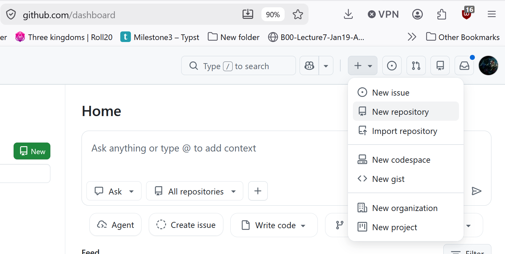
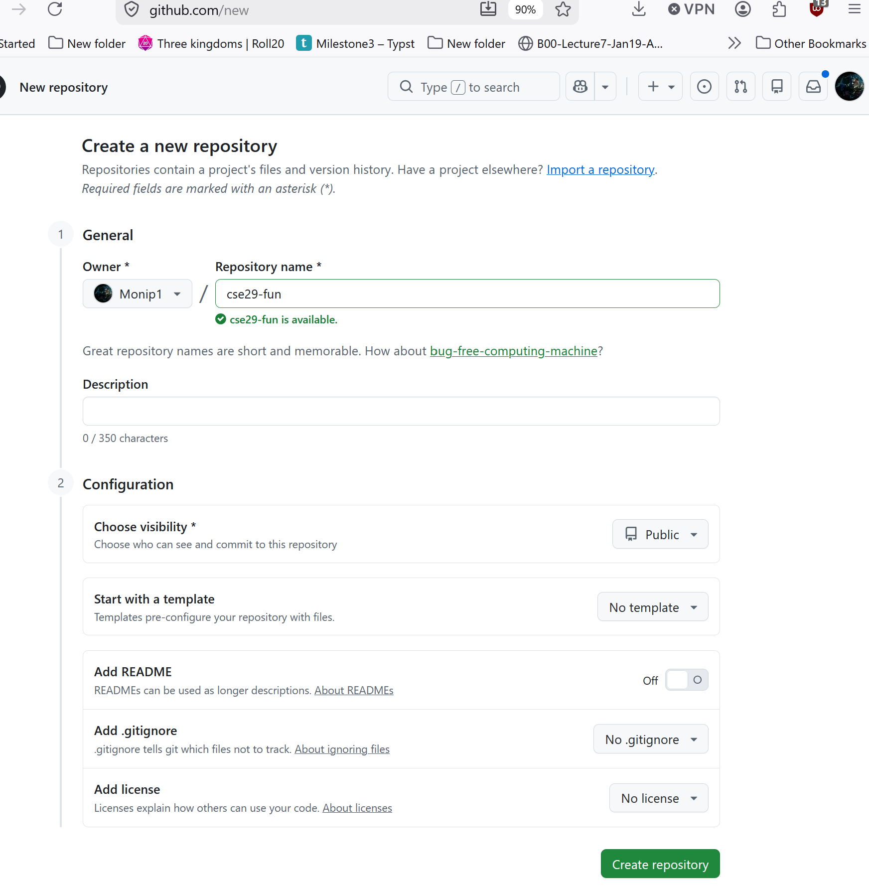
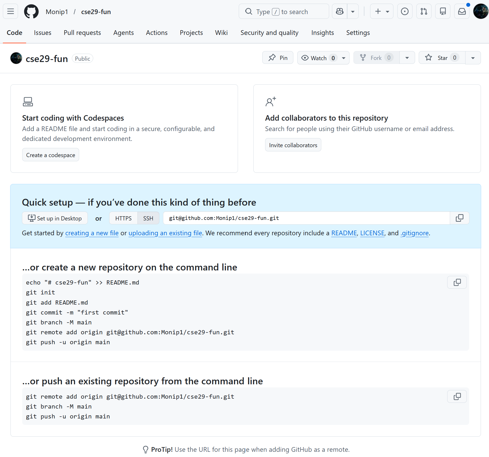
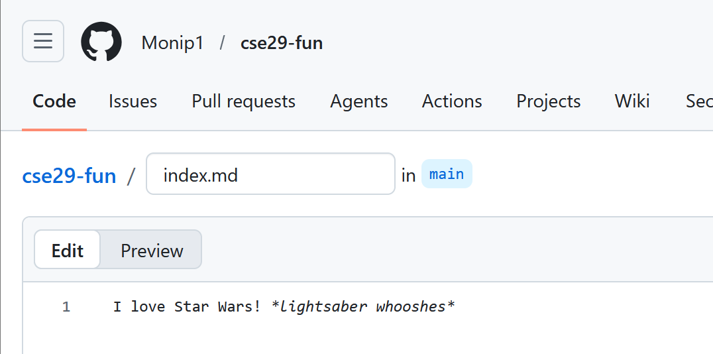
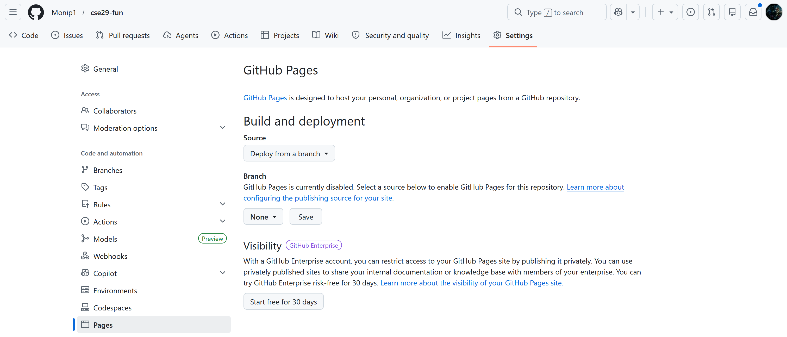
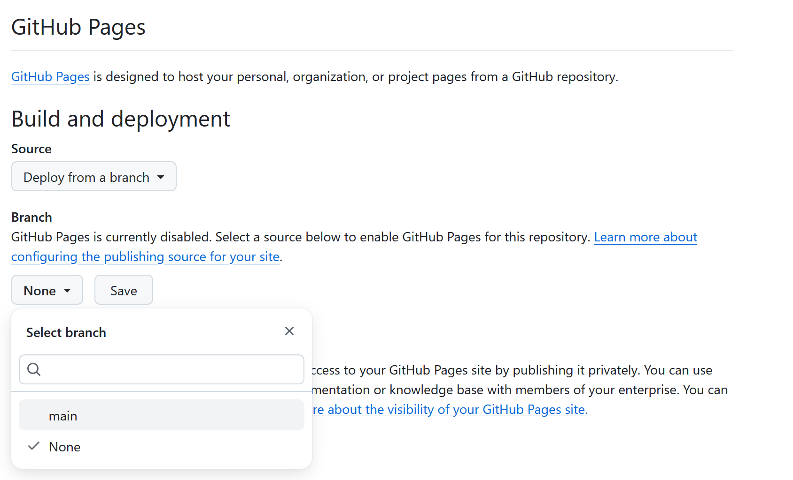
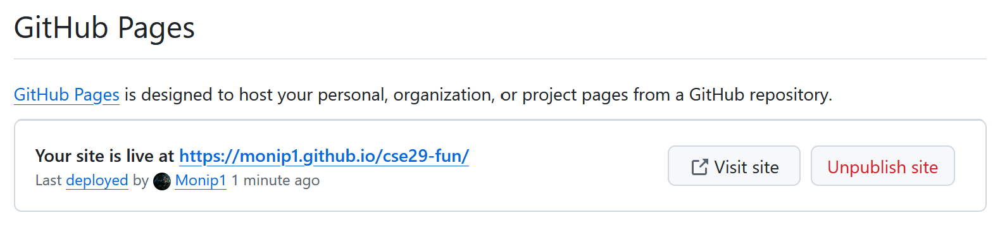
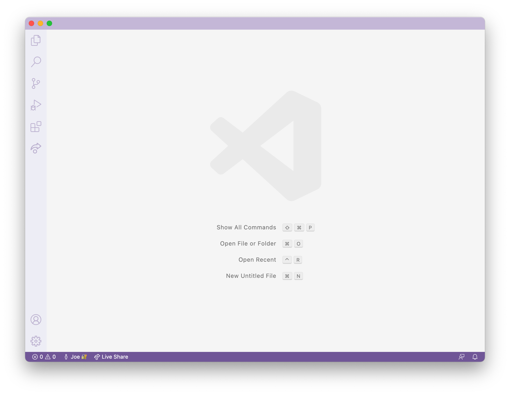

# Lab 9: Github Pages
{: .no_toc}

#### Table of contents
{: .no_toc}

1. TOC
{:toc }

## Related Links
{: .no_toc}

- [About Git](https://docs.github.com/en/get-started/using-git/about-git)
- [Github](https://github.com/)
- [Github Pages](https://pages.github.com/)
- [Github Desktop](https://desktop.github.com/)
- [Markdown cheat sheet](https://commonmark.org/help/)
- [What is Markdown?](https://www.markdownguide.org/getting-started/)
- [Git](https://git-scm.com/)
- [Lab Doc](https://docs.google.com/spreadsheets/d/1otg_99XZKDlf7_rpDagsQmmb3jqUd0qvWUjhWcX-sVY/edit?usp=sharing)

## Key Definitions

- **git repository**: A folder that tracks the history of edits to its files
- **Github repository**: A git repository online, like a Google Drive folder with history
- **Github pages**: A service that takes a Github repository and builds a
website from it (usually relying on conventions, like `index.md`)
- **Markdown**: A way to write plain text files with a little bit of formatting
- **commit**: A set of changes to a file or multiple files in a repository. A
repository history is made up of commits
- **git clone**: A git action to copy a repository from one place to another
(usually from somewhere like Github to our computer). Copies the contents of the
folder _and_ the entire history – the whole repository.
- **git commit**: A git action to take some changes we've made to files and
turn them into a commit in the repository's history
- **git push**: A git action to send commits from one place to another (usually
from our computer to Github)

## Lab Tasks

In this lab you'll make a professional website for yourself where you can post your lab reports for the course. Please contact your instructor (asoosairaj@ucsd.edu or oweng@ucsd.edu) if for personal privacy or security reasons you do not want to publish a public website, even under a pseudonym.

### Part 5 – git, Github, and Github Pages

Having a professional portfolio website for yourself can be useful in many, many ways. It's a useful URL to put at the top of your resume/CV where potential employers can learn more about you.  Lots of great work in CS is published only on someone's personal page, or is at least most accessible there.  Most CS faculty have such a page ([just](https://roseyu.com/) [a few](https://cseweb.ucsd.edu/~tzli/) [examples](http://kvaccaro.com/) [from new](https://web.engr.oregonstate.edu/~jensenca/OSU_ENGR/index.html) CSE faculty), for example.

Also, journaling and logging what you've learned is a powerful tool. Writing down what we've done and how we've done it, for an audience (real or imagined) other than ourselves, forces us to confront lingering misconceptions and cements what we learned in our memories. It's also simply useful to refresh your memory later!

For these reasons, we'll spend the rest of this lab creating a personal page, and then learning to write a blog post about what we learned.

Github ([https://www.github.com](github.com)) is a web service for storing and
sharing code, along with a huge number of services surrounding that code. It
uses a tool and protocol called `git` [https://git-scm.com/](https://git-scm.com) to store and
retrieve that code. Github Pages
[https://pages.github.com/](https://pages.github.com/) is one of the services
Github provides for publishing personal and project websites from your Github
account.

This lab is a basic introduction to all of these. We will learn to use them in
more detail as the quarter goes on; learning all that git, Github, or Github
Pages has to offer could take months of practice!

### Part 6 – Creating a Website with Github Pages

This section will show you how to create a site with Github Pages that you'll
use for your lab reports.

There are written instructions with screenshots below you can follow, and also a
video:

<iframe width="560" height="315" src="https://www.youtube.com/embed/GZqizez1Dzs" title="GitHub Pages Youtube Video" frameborder="0" allow="accelerometer; autoplay; clipboard-write; encrypted-media; gyroscope; picture-in-picture; web-share" allowfullscreen></iframe>

#### Create a Repository

On your github account, we are going to _create a new repository_ on
Github. A _repository_ is a folder or directory with an associated history of
changes that were made to the files within it. In this sense, a repository on
Github has some similarities to a folder in Google Drive; the differences are
mainly in the level of control we get in managing that history of changes.

Name the repository `cse15l-lab-reports` (in my screenshot it looks like the
name is taken because I made it before taking the screenshot; it will be green
and OK for you). Leave the other settings as they are, and click "Create
Repository" at the bottom.

You should see a screen like this (but with your username):

Click the "Create a new file" link (small, in blue, beneath the "Set up in
Desktop" button). Make a new file called `index.md`, and put some text in it
(whatever you like).

Scroll down to the bottom of the page and click "Commit new file". You should see
a view of your repository that now lists a file called `index.md`.

You have a public Github repository with some text in it! You can copy the link from your browser and send it to your friends and family to view!

#### Making a Pages Site

Next, click on "Settings" at the top of your repository, and then choose the
"Pages" option in the sidebar:

Choose `main` as the source for Github Pages, and click "Save".

At the top it'll say “GitHub Pages source saved". Wait a bit and refresh the
page. Eventually you'll see a message that says “Your site is live at `<url
here>`.” (This can take a few minutes!) Click the link that's shown there; at
first it will say the page isn't found. Wait a few minutes, then refresh the
page.  Then you should see the text you wrote show up on a page like this:

<!-- **Write down in notes** – everyone should be able to screenshot their page
showing the text they wrote in their `index.md`.

**Write down in notes** – Conduct the following experiment: -->
Note that in addition to seeing your file at, e.g,
[https://jpolitz.github.io/cse-15l-lab-report/](https://jpolitz.github.io/cse-15l-lab-report/),
you can also see it with `index.html` added to the end of the URL:
[https://jpolitz.github.io/cse-15l-lab-report/index.html](https://jpolitz.github.io/cse-15l-lab-report/index.html)
(Try it!).

**Do now!** Add another file to your repository with any name you choose, but
end it in the extension `.md`. Can you use this idea to see that file?

<!-- Write down what you think is happening when you commit a new file. -->
#### Editing Markdown

The `.md` extension stands for "Markdown," which is a particular text format
used for writing. There are many good documents on the web. A good cheat sheet
and explainer are here:

- [Cheat sheet](https://commonmark.org/help/)
- [What is Markdown?](https://www.markdownguide.org/getting-started/)

Skim both of those documents, then try to use some of the elements described in
the cheat sheet in your `index.md` file. How do some of the different formatting
options show up when you use them? Are any surprising?

<!-- **Write down in notes** – Try all of the formatting in the “Basic Syntax” part
of the markdown cheat sheet above; everyone should screenshot their page that
uses all of these. -->
You should now have:

- A repository with at least two files (`index.md` and another one you made up)
- In one of those files, a use of each kind of basic Markdown syntax
- A page that shows the rendered version of your Markdown text at a public URL

**Congratulations** – you now know how to make a (simple), public-facing website
with basic formatting! You can share the link to your page with anyone in the
world with an internet connection, and they can see your page.

(Fun fact: [the page you are
reading](https://github.com/ucsd-cse15l-s23/ucsd-cse15l-s23.github.io/blob/main/_posts/weeks/2023-01-09-week1.md)
is written in Markdown and uses Github Pages!)

#### Before you leave

Please go ahead and fill out this Google form before you leave, this will help us create the seating chart for next week. [Link to Google form](https://forms.gle/5PPvrtnzPMdry68f9)

**How do I submit my Github Pages site to Gradescope?**

Visit your Github Pages website with your tutorial in a browser (Safari, Chrome, Brave, 
Firefox, Edge, etc), and use “Print” to save it to a PDF. Then, upload the PDF to the 
“Lab Report 1 - Remote Access and Filesystem” assignment on Gradescope. For example, 
if your Github Pages site has the link [https://pandrew99.github.io/cse15l-lab-reports-example](https://pandrew99.github.io/cse15l-lab-reports-example)
and you made your lab report 1 .md file called `lab1.md`, you would access it by adding `lab1.html` 
at the end, like: [https://pandrew99.github.io/cse15l-lab-reports-example/lab1.html](https://pandrew99.github.io/cse15l-lab-reports-example/lab1.html).
The format of the PDF you submit should look something like this:

    
**Can I use screenshots from the lab document we worked on together?**

Sure! If they are from your account, that's fine. Don't share another person's screenshots,
instead describe where you got stuck and include a screenshot of what doesn't
work.

### Part ? -- Installing VSCode and git on your computer

Go to the Visual Studio Code website
[https://code.visualstudio.com/](https://code.visualstudio.com/), and follow the
instructions to download and install it on your computer. There are versions for
all the major operating systems, like macOS (for Macs) and Windows (for PCs).

When it is installed, you should be able to open a window that looks like this
(it might have different colors, or a different menu bar, depending on your
system and settings):

Then if you're on Windows: install `git` for Windows, which comes with some
useful tools we need:

[Git for Windows](https://gitforwindows.org/)

Once installed, use the steps in this post to set your default terminal to use
the newly-installed `git bash` in Visual Studio Code:

[Using Bash on Windows in VScode](https://stackoverflow.com/a/50527994)

(That's all the special instructions for Windows users). 

Then, to run commands, open a terminal in VScode. (Ctrl or Command + \`, or use the Terminal → New
Terminal menu option). Try running some of the commands we learned in earlier
labs and lectures on this computer.

## Codespaces
### *Alternative way of working with a GitHub repository* 
There is an alternative way of working with our repository, and we *highly recommend* you try working with GitHub Codespaces (which comes with the GitHub Student Developer Pack)! More documentation is available [here](https://docs.github.com/en/codespaces). It is an online Integrated Development Environment that allows us to work with our code directly online! 

**Important Note:** Make sure you apply for your Github Student Account in order to get access to the codespaces. 

*(Only if you set up GitHub Codespaces -- highly recommended)* Go to a repository on GitHub and click “<> Code”, click "Codespaces", click "Create codespace on main"