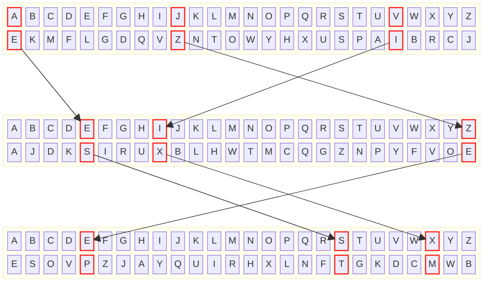
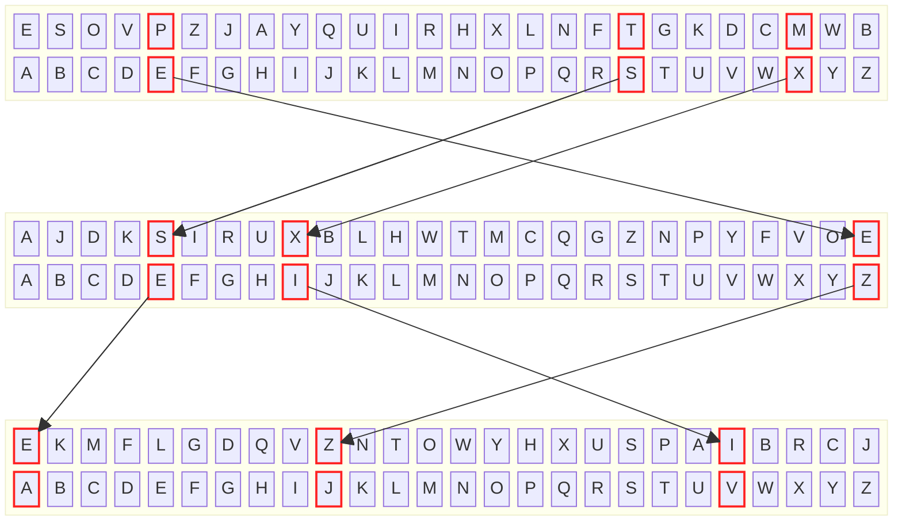

# PA 1: Enigma Machine
{: .no_toc}

Due date: April 21 23:59 PDT
{: .fs-4 }

[GitHub Classroom Assignment](https://classroom.github.com/a/fLd9TVsl){: .btn .btn-blue }


## Updates
{: .no_toc }

- Nothing yet!

#### Table of contents
{: .no_toc}

1. TOC
{:toc }

## Learning Goals

In this assignment, we will:

* Learn how to write a C program that follows given specifications
* Learn how functions improve code by making it modular and task-oriented
* Practice writing functions with arguments and return values in C
* Develop code using one-dimensional and two-dimensional arrays
* Allocate memory for arrays dynamically on the heap

## Getting Help

In CSE29, we have lots of ways to get and receive help. We encourage you
to take advantage of all of them! Study groups, office hours, and
EdStem are all great places to ask questions and collaborate with your peers. :\)

## Before we Begin

{: .warning}
Read the whole thing!

### The Importance of Reading

One of the best ways to _suffer_ in CSE 29 programming assignments is not
**paying enough attention to the assignment specifications**. Yes, these
documents can be very long, but they are long because they contain a lot of
useful information that you will need to successfully complete the tasks.

Reading technical specifications is one of the most important skills to have as
a software engineer. Not only should you become comfortable with reading long
specifications, you also need to be able to read and understand documentations,
which you will have plenty of opportunity to practice throughout this quarter.

Do **not** shy away from reading! Read this whole document thoroughly!

### Incremental Development and Testing

Another good way to _suffer_ in CSE 29 is to **not** follow the principles of
incremental development and testing.

A very critical skill we hope you will obtain after CSE 29 is that of
_problem decomposition_: how to break down a complicated problem into smaller parts?
In some ways, we help you with that in CSE 29 by providing you with structured
skeleton code for each assignment, so that you can see what the smaller tasks
are for each PA. But with that, you still need to take an _incremental_ approach
to programming.

Put simply, **don't write too much code at once without testing**. If you have
written a few lines of code, think about how you can test it to make sure
everything is working as intended before moving on to the next part.

If you don't, bugs will inevitably pile up and bury you underneath.

You should never find yourself compiling and running your code for the first time
only after thinking you have finished coding the entire assignment.

We speak from experience.

Follow our advice!

Please?

## Introduction

In this project, you will follow the program specifications given below, to
write a C program which implements a simplified version of an encrypting and
decrypting machine called **Enigma**.

The Enigma was invented by German engineer Arthur Scherbius and was used during
World War II. This machine accepts the message that needs to be _encrypted_,
uses some predefined rotors to encrypt the message and _outputs the result_.
Also, it can _accept encrypted messages_ and _decrypt_ them.

In this project, you will implement both of these functionalities.


{: .note }
The Enigma you implement in this PA might seem simple by the end, but the
Enigma machine was **not**. It was used by the German military to encrypt and
decrypt messages during World War II. The Enigma machine was considered
**unbreakable** until the British mathematician Alan Turing (yes, _that_ Turing)
and his team at Bletchley Park cracked the code.
Learn more [here][1].

[1]: https://en.wikipedia.org/wiki/Enigma_machine

## Encryption and Decryption

### Encryption in Enigma

The Enigma machine uses so-called _rotors_ to encrypt messages. In the starter
code for `enigma.c`, there is an array of strings called `enigma_rotors` that
stores 9 rotors. For our project, the rotor at position 0 is an _identity rotor_.
It is basically a string with the Latin alphabet in the normal alphabetical order.

{: .note }
Rotor 0 is given to help you better see how the encryption and decryption processes
occur. This rotor is not helpful for encryption because the encrypted message
would be identical to the plain text input.

Rotors at positions 1 - 8 of the array `enigma_rotors` are strings with the letters
of the alphabet appearing in various orders. For example, the rotors 0 to 3 are shown below.

```
Rotor 0 - ABCDEFGHIJKLMNOPQRSTUVWXYZ
Rotor 1 - EKMFLGDQVZNTOWYHXUSPAIBRCJ
Rotor 2 - AJDKSIRUXBLHWTMCQGZNPYFVOE
Rotor 3 - BDFHJLCPRTXVZNYEIWGAKMUSQO
```

#### Encryption: One Rotor

The encryption process can involve one or multiple rotors.
Let's look at an example:

<div class="language-plaintext highlighter-rouge">
  <div class="highlight">
    <pre class="highlight">
<code>Message to be encrypted: <x-em>JAVA</x-em>
Rotors to use: 1
Number of rotations: 0
Encrypted message: <x-em>ZEIE</x-em>

<x-em>A</x-em> B C D E F G H I <x-em>J</x-em> K L M N O P Q R S T U <x-em>V</x-em> W X Y Z  -> rotor 0
<x-em>E</x-em> K M F L G D Q V <x-em>Z</x-em> N T O W Y H X U S P A <x-em>I</x-em> B R C J  -> rotor 1</code></pre>
  </div>
</div>

The position of `J` in the original alphabet is `9`. Therefore, the Enigma
finds the letter at position `9` on `rotor 1`, which is `Z`. Similarly, the
position of `A` in the original alphabet is `0`. So, the Enigma finds the letter
at position `0` on `rotor 1` which is `E`, etc. This is how the message `JAVA`
has been encrypted to `ZEIE` using `rotor 1` _without performing any rotations_.

#### Encryption: Multiple Rotors

Let's look at another example but this time with multiple rotors.
Encryption using multiple rotors essentially repeats the process
demonstrated above multiple times. The output of the first round
of encryption is fed as the input to the second round of encryption, and so on.

<div class="language-plaintext highlighter-rouge">
<div class="highlight">
<pre class="highlight"><code>Message to be encrypted: <x-em>JAVA</x-em>
Rotors to use: 1 2 4
Number of rotations: 0
Encrypted message: <x-em>PTMT</x-em>

The rotors 1, 2, and 4 that are used for encryption are shown below:
E K M F L G D Q V Z N T O W Y H X U S P A I B R C J -> rotor 1
A J D K S I R U X B L H W T M C Q G Z N P Y F V O E -> rotor 2
E S O V P Z J A Y Q U I R H X L N F T G K D C M W B -> rotor 4
----------------------------------------------------

Round 1:
<x-em>A</x-em> B C D E F G H I <x-em>J</x-em> K L M N O P Q R S T U <x-em>V</x-em> W X Y Z  -> rotor 0
<x-em>E</x-em> K M F L G D Q V <x-em>Z</x-em> N T O W Y H X U S P A <x-em>I</x-em> B R C J  -> rotor 1
(result is <x-em>ZEIE</x-em> after using rotor 1 for encryption)

Round 2:
A B C D <x-em>E</x-em> F G H <x-em>I</x-em> J K L M N O P Q R S T U V W X Y <x-em>Z</x-em>  -> rotor 0
A J D K <x-em>S</x-em> I R U <x-em>X</x-em> B L H W T M C Q G Z N P Y F V O <x-em>E</x-em>  -> rotor 2
(result is <x-em>ESXS</x-em> after using rotor 2 for encryption)

Round 3:
A B C D <x-em>E</x-em> F G H I J K L M N O P Q R <x-em>S</x-em> T U V W <x-em>X</x-em> Y Z  -> rotor 0
E S O V <x-em>P</x-em> Z J A Y Q U I R H X L N F <x-em>T</x-em> G K D C <x-em>M</x-em> W B  -> rotor 4
(result is <x-em>PTMT</x-em> after using rotor 4 for encryption)</code></pre>
</div></div>



The first round of encryption, as we saw previously, is done using the first rotor,
and the result is `ZEIE` in our example. This result is then passed on to `rotor 2`, the
output of which is `ESXS`. This is then passed on to `rotor 4` which gives us the final
encrypted message `PTMT`.

See why this took so long to crack?

### Decryption in Enigma

The decryption process reverses the encryption process. To decrypt the message
`PTMT` that we encrypted in the previous example back to `JAVA`, the order of the rotor
selections is reversed. Since we applied rotors 1, 2, and then 4 for encryption, we
should apply rotors 4, 2, and then 1 for decryption.

```
Message to be decrypted: PTMT
Rotors to use: 4 2 1
Number of rotations: 0
Decrypted message: JAVA

The rotors 4, 2, and 1 that are used for decryption are shown below:
E S O V P Z J A Y Q U I R H X L N F T G K D C M W B -> rotor 4
A J D K S I R U X B L H W T M C Q G Z N P Y F V O E -> rotor 2
E K M F L G D Q V Z N T O W Y H X U S P A I B R C J -> rotor 1
```



First, we start with Rotor 4 and find the letters `PTMT`. We then find the letters
in these positions on the identity rotor, i.e. Rotor 0. This gives us `ESXS`.

We then pass `ESXS` to Rotor 2 and decrypt it to `ZEIE`. Finally, we pass `ZEIE` to
Rotor 1 and decrypt it to `JAVA`.

### Rotating the rotors

While performing encryption or decryption of the message, we enter some
**non-negative** integer number of rotations, which is the number of times to
rotate a rotor's values to the right. (You might want to rotate the rotors
to help prevent people from catching onto the pattern!)

For example, to perform `rotation = 3` on Rotor 1, then

```
Rotor 1: 	E K M F L G D Q V Z N T O W Y H X U S P A I B R C J
Rotated rotor 1: R C J E K M F L G D Q V Z N T O W Y H X U S P A I B
```

After rotating _all_ the rotors being used, encryption or decryption can be performed
as usual on the rotated rotors.

{: .important}
If you rotate the rotors `n` times during encryption, you should rotate them `n` times during decryption as well to get the correct output.

## Getting Started

Now that we have a decent understanding of how the Enigma machine works, it's time
to make our own.

All of our programming assignments will be hosted on GitHub Classoom.
Use the following link to accept the GitHub Classroom assignment.

[Click here to accept this GitHub Classroom assignment.](https://classroom.github.com/a/fLd9TVsl) (Right click to open in new tab)

Once the assignment is accepted, you will see a repository generated for you
with the starter code for this assignment. Click the link to go to the
repository.

{: .important }
If you haven't done Lab 2 yet, please follow the instructions for Lab 2
up until _Git Gud Bro_ to authorize your `ieng6` account to access your assignment
repository on GitHub. You should also refer to these instructions whenever you
encounter anything unclear about Git in the remainder of this PA.

Using commands from the lab instructions, **clone** your new repository
into your `ieng6` account. It should contain `enigma.c` and `README.md`.
In this course, you should use Vim to work on all PAs.

{: .warning}
Can I get started now? Y- No. Read the whole thing.

## Program Specifications

Familiarize yourself with the skeleton code in `enigma.c` to understand
the structure and where to implement your functions.

1. **🚫 YOU SHOULD NOT:**
	- Modify the **parameters** of any function we provide in `enigma.c`,
	- Modify the **return type** of any function we provide in `enigma.c`,
	- Include any other libraries apart from the ones provided.
	  You can write your own utility functions if you need them.
2. The command-line arguments are:
  - **Mode** (`e` for encryption or `d` for decryption)
  - **Input text** (string to be encrypted or decrypted, which can contain
    uppercase and lowercase letters, numbers, and special characters)
  - **Number of rotors** (integer $$r$$ where $$1 \leq r \leq 9$$)
  - **Rotor indices string** (sequence of space-separated indices of the rotors to apply,
    where each index $$i$$ satisfies $$1 \leq i \leq 8$$). Your program should not traverse this sequence in reverse order during
    decryption, as it should already be reversed; see our [public tests](#multiple-rotors-without-rotation)
    for examples.
  - **Number of rotor rotations** (any non-negative integer)

    For example, running `./enigma e "JAVA" 3 "1 2 4" 2` should encrypt the string
    `"JAVA"` using rotors 1, 2, and then 4 after each rotor is rotated to the right 2 times.

3. **The input is guaranteed to be properly formatted.**
	This means that we will not test your code against invalid input, and
  you can assume that all test cases follow the correct format specified
  above. You do not need to check for invalid inputs.

{: .note }
> Make sure that you review the [relevant Dive Into Systems page](https://diveintosystems.org/book/C2-C_depth/advanced_cmd_line_args.html)
> for how to parse command-line arguments.

## Skeleton Code Description

The first step of the program is to extract all the command-line arguments
and store them in variables (using appropriate data types). Once this is completed,
you can start implementing and calling the functions listed below **from within
your `main()` function**.

### The `parse_rotor_indices()` function

```c
int *parse_rotor_indices(char* rotor_ind_str, int num_rotors);
```

This function should parse the rotor indices string and return an array of integers.
The array should contain the indices of the rotors to be used for encryption or
decryption.

For example, if the input is `"1 3 4"` and `3`, then the function should return
an array of integers containing `[1, 3, 4]`.

### The `set_up_rotors()` function

```c
int **set_up_rotors(int* rotor_indices, int num_rotors);
```

This function creates and returns a 2D array representing the rotor configuration.
It should have `num_rotors` rows and 26 columns. Each row `i` should represent
the `i`th rotor to use according to `rotor_indices`, where each element in the row
stores the distance from `'A'` to each corresponding letter in the rotor
(`A` becomes `0`, `B` becomes `1`, `C` becomes `2`, etc.)

For example:
```
Rotor 1 contains: EKMFLGDQVZNTOWYHXUSPAIBRCJ
Representation:   [4 10 12 5 11 6 3 16 21 25 13 19 14 22 24 7 23 20 18 15 0 8 1 17 2 9]
```
For the configuration `[1, 3, 4]`, the 2D array returned should be:
```
[4 10 12 5 11 6 3 16 21 25 13 19 14 22 24 7 23 20 18 15 0 8 1 17 2 9]
[1 3 5 7 9 11 2 15 17 19 23 21 25 13 24 4 8 22 6 0 10 12 20 18 16 14]
[4 18 14 21 15 25 9 0 24 16 20 8 17 7 23 11 13 5 19 6 10 3 2 12 22 1]
```

### The `rotate_rotors()` function

```c
void rotate_rotors(int** rotor_config, int num_rotors, int rotations);
```

This function accepts the 2D array `rotor_config` from the previous function,
the number of rotors to use, and the number of `rotations`.
The function should rotate each rotor in `rotor_config` to the **right** by
`rotations` positions, as explained [above](#rotating-the-rotors).

If the number of rotations exceeds **25**, the rotations should "wrap around".
Example scenarios:

```
If rotations = 26, rotate by 0 positions (complete cycle back to start)
If rotations = 27, rotate by 1 position
If rotations = 52, rotate by 0 positions
If rotations = 29, rotate by 3 positions
```

For example, with the inputs
```
rotor_config:
[4 10 12 5 11 6 3 16 21 25 13 19 14 22 24 7 23 20 18 15 0 8 1 17 2 9]
[1 3 5 7 9 11 2 15 17 19 23 21 25 13 24 4 8 22 6 0 10 12 20 18 16 14]
[4 18 14 21 15 25 9 0 24 16 20 8 17 7 23 11 13 5 19 6 10 3 2 12 22 1]

rotations: 29
num_rotors: 3
```

The function should change `rotor_config` into:

```
[17 2 9 4 10 12 5 11 6 3 16 21 25 13 19 14 22 24 7 23 20 18 15 0 8 1]
[18 16 14 1 3 5 7 9 11 2 15 17 19 23 21 25 13 24 4 8 22 6 0 10 12 20]
[12 22 1 4 18 14 21 15 25 9 0 24 16 20 8 17 7 23 11 13 5 19 6 10 3 2]
```

### The `encrypt()` and `decrypt()` functions

```c
char* encrypt(char *message, int** rotor_config, int num_rotors);
char* decrypt(char *message, int** rotor_config, int num_rotors);
```

These functions both accept a string `message` to be encrypted or decrypted,
the 2D array `rotor_config`, and the number of rotors. They should make a
copy of `message` and **should not modify `message` itself**.

{: .warning }
Do not modify the contents of `message` in either `encrypt` or `decrypt`! Your
program should pass a string from `argv` directly into `encrypt` or `decrypt`.
If you were to modify the contents of `message` in these functions, you would
effectively modify the contents of `argv`. However, our conventions dictate that
`argv` should always hold the command-line arguments passed in and should not be
modified, so this violates our conventions. **Modifying `message` in `encrypt`
or `decrypt` will cause unit tests to fail.**

The keen-eyed among you will notice that the rotors only have uppercase letters.
So, these functions should change the string to all uppercase characters before
encryption or decryption.

Both functions will return strings. The `encrypt()` function should return the
encrypted message, and the `decrypt()` function should return the decrypted message.
The strings returned will always be UPPERCASE.

Input messages can contain whitespaces, numbers, and special characters in addition
to uppercase `(A-Z)` and lowercase`(a-z)` letters, but only the letters will be
encrypted or decrypted and the rest will remain the same. For example, the message
`"Hello, PA 1!"` should be transformed into `"HELLO, PA 1!"` before encryption.

## Tests

Your solution must be tested comprehensively to ensure that you have more than just
hopes and prayers to rely on when you submit your code. Testing is also an
essential responsible practice for software engineering professionalism.

Importantly, part of your submission will include writing _unit tests_ for your code.
As review, unit tests are tests that verify the correctness of individual functions
of code.

### Writing Unit Tests

Let's say we had the following function (which isn't from this PA, but just an example):

```c
// This function is supposed to add two integers and return the result, but it has a bug.
int add(int a, int b) {
    return a + 0;
}
```

Astute readers will immediately notice that this function is incorrect,
as it doesn't add `b` to `a`. If we were to write a unit test for this function,
we would be able to catch this bug. A unit test for this function might look like this:

```c
void test_add_ok() {
    int actual_result = add(2, 3);
    int expected_result = 5;
    if (actual_result != expected_result) {
        printf("test failed.\n");
    }
}
```

Notice that if the test passes, then nothing will be printed. If the test _fails_, however,
then we'll get a nice message printed to the console. This is a pretty simple unit test,
but it helps us catch a pretty nasty bug!

As part of your submission, **you should write at least one unit test
for each of the functions you implement in `enigma.c`**. For example:
this means that for the `parse_rotor_indices()` function,
you should write a test function which calls `parse_rotor_indices()` with some input
and checks if the output matches your expected output. To pass the autograder,
your tests should only print something to the console if the test fails,
and should not print anything if the test passes.

You should call these functions from `main()` to test them. You can
write more unit tests if you want to, and we encourage you to do so!


{: .warning}
If you plan to rely on the autograder to test your code, keep in mind that you
will only be able to see your program's performance against the public test cases.
The performance of your code on the hidden test cases will remain unavailable
until after the deadline. Therefore, make sure to think carefully about your unit tests!

Here are the public test cases that we will run on your code (_you should too_):

### Only 1 rotor without rotation

```bash
$ ./enigma e "JAVA" 1 "5" 0
Encrypted message: VUNU

$ ./enigma d "VUNU" 1 "5" 0
Decrypted message: JAVA
```

### Multiple rotors without rotation

```bash
$ ./enigma e "JAVA" 2 "5 4" 0
Encrypted message: DKHK

$ ./enigma d "DKHK" 2 "4 5" 0
Decrypted message: JAVA
```

### Multiple rotors with rotation

```bash
$ ./enigma e "JAVA" 2 "5 4" 3
Encrypted message: KXQX

$ ./enigma d "KXQX" 2 "4 5" 3
Decrypted message: JAVA
```

Please devise more tests to account for more requirements from this specification!
Our hidden tests aim to verify that all our requirements are met.

## Formatting Your Code

Coding style dictates how code is laid out in a file. As you read more and more code throughout your career, you will realize the importance of having a clean and consistent coding style.

It’s what makes this so hard to understand:
```c
#include<stdio.h>
int main(){
int l;


  printf("Enter a limit: ");


          //scanf("%i", limit);
          scanf("%d", &limit);
        printf("Even numbers between 1 and %d:\n", limit);
    for (int i=1;i<=l; i++) {
    if (i%2 ==0) {
      //printf(i);
        printf(  "%d ",i);
    }
}
printf ("\n");
    return 0;

}
```

...whereas this is nice, clean and straightforward to read:

```c
#include <stdio.h>

int main()
{
    int limit;

    printf("Enter a limit: ");
    scanf("%d", &limit);

    printf("Even numbers between 1 and %d:\n", limit);
    for (int i = 1; i <= limit; i++) {
        if (i % 2 == 0) {
            printf("%d ", i);
        }
    }
    printf("\n");

    return 0;
}
```
The latter is neat, well-indented, readable, commented and split into
logical blocks. The former is an unholy mess, which sadly, we encounter far too
often in office hours. While both pieces of code do work perfectly fine in C,
tracing through and debugging the latter example is infinitely easier than the former.

Who has time to format their code all the time? I hear you ask. It's generally
a good idea to keep your code well-formatted as you work on it. However, we also
have a tool that can automatically format your code for you. This tool is called
`clang-format`.

### Running `clang-format`

We have created a `.clang-format` file for you that contains all the right settings
to work for your code in particular.
In your directory with your C code, run the following command:

```
$ clang-format -i *.c
```

The `-i` flag tells `clang-format` to modify the source files **in place**,
which means changes will be made directly to the files. `*.c` tells the
program to format all files with the extension `.c` in the working directory.

## Citing AI Usage

As stated in the [course syllabus](/syllabus):

> If you use AI to help you on a PA, we would like you to briefly cite how you
> used AI in the contributions section of each PA. This citation allows us to
> understand the role of AI in the learning process, and will not impact your grade.

For this PA, **please describe your AI usage in `CREDITS.txt`**, which should be in
your starter repository. **If you did not use AI, you must state this in
`CREDITS.txt`.** The autograder will require you to edit `CREDITS.txt` to
get points.

## Submission Instructions

When you're ready to submit, make sure to **commit** and **push** your latest
code to your GitHub repository. Then, you can submit your assignment directly
from your GitHub repository.

{: .warning }
In this course, you probably have accidentally ran your program after editing the
source code without recompiling it. Similarly, you will probably submit your
assignment on Gradescope without pushing your latest changes to GitHub at least once.
Always make sure your repository on GitHub is up-to-date before submitting!

Steps to submit via Gradescope:
- Navigate to the submission page for this PA using the button below. (We haven't set up the Gradescope page yet, but we will update this section once we do.)
- When you submit the assignment, you will see the option to submit from a specific GitHub repository.
- Link your GitHub account if you haven’t already.
- Select your PA 1 repository and choose the main branch for submission.

<!-- [Go to Gradescope](https://www.gradescope.com/courses/1013315/assignments/6045550){: .btn .btn-purple } -->

<!-- ## Reflection Survey 1

The last part of this assignment is a reflection survey.
Please spend a few minutes reflecting on your experience in this course and
give thoughtful and truthful answers.

{: .note }
This survey (and others that follow) is not anonymous because (1) you will receive credit for completing this survey and (2) the teaching staff would like to be able to reach out to help students who might need extra support.

[Take Reflection 1 Survey](https://docs.google.com/forms/d/e/1FAIpQLSf-mEMhvEPvqePrK7w5M5eLVkPwQYv-Dmvc2cDvIxpNoakgQw/viewform?usp=sharing){: .btn .btn-purple }

## Grading and Point Distribution

To give you a fair amount of partial credit, we will evaluate each of the
functions described above on their own using **unit tests**, which will run
each function in isolation and evaluate its results. We will not run your
`main()` function in unit tests. Then, we will compile your program and
verify correct encryption and decryption behavior in **end-to-end tests**,
which will run your `main()` function with command-line arguments and evaluate
the program's output.

| Type | Breakdown | Points |
|:-----|:----------|:-------|
| Unit tests | 3 points per function described in [Skeleton Code Description](#skeleton-code-description) | 11 public + 4 hidden |
| End-to-end tests | 4 points for encryption, 4 points for decryption | 4 public + 4 hidden |
| Reflection survey | 2 points for completion | 2 |

Total: 25 points
{: .fs-5 .fw-500 } -->

<style>
  pre.highlight {
    line-height: normal;
  }

  .highlight code {
    font-size: 15px;
    color: #131313;
  }

  x-em {
    font-weight: bold;
    display: inline-block;
    border: 1px solid #220000;
  }
</style>
